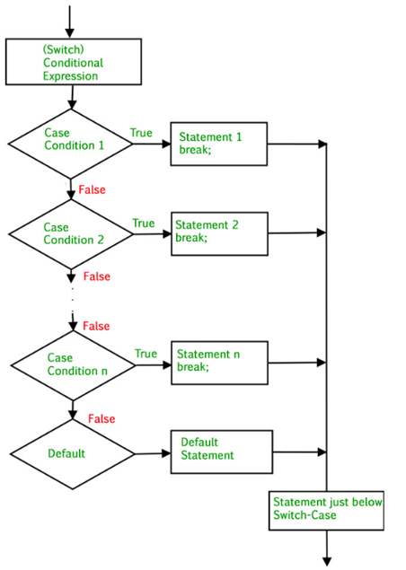

# Switch statement

คำสั่ง switch ใช้เพื่อดำเนินการคำสั่งหนึ่งจากหลายเงื่อนไข ทำงานคล้ายกับคำสั่ง if-else-if มาเรียนรู้เรื่องนี้ไปพร้อม ๆ กันนะคะ &#x20;

## ข้อสังเกตเกี่ยวกับ switch case:

1\.      default เป็นคำสั่งที่ไม่จำเป็นต้องมีก็ได้ แต่ถ้ามี default ต้องอยู่เป็นคำสั่งสุดท้ายเสมอ

2\.      switch มี default ได้เพียงตัวเดียวเท่านั้น หากมีมากกว่าหนึ่งจะทำให้เกิดข้อผิดพลาดแบบ Fatal error

3\.      แต่ละ case จะมีคำสั่ง break เพื่อใช้หยุดการทำงานของลำดับคำสั่งใน case นั้น

4\.      คำสั่ง break ใน switch มีหรือไม่มีก็ได้ แต่ถ้าไม่มี คำสั่งหลังจากที่เจอค่า case ที่ตรงกันจะถูกดำเนินการทั้งหมด

5\.      สามารถซ้อนคำสั่ง switch ด้วย switch อีกตัวได้(Nested switch) แต่โปรแกรมจะซับซ้อนและอ่านยากขึ้น

6\.      ใช้เครื่องหมายเซมิโคลอน (;) แทนเครื่องหมายโคลอน (:) ได้ โดยจะไม่ทำให้เกิดข้อผิดพลาดใด ๆ

## PHP Switch Flowchart

<figure><figcaption></figcaption></figure>

เรามาดูการทำงานของคำสั่ง switch-case จาก flowchart ในรูปข้างบนกันค่ะเพื่อน ๆ

1\. โปรแกรมจะเริ่มตรวจสอบค่า expression ใน switch ก่อน เพื่อดูว่ามีเงื่อนไขตรงกับ case ใดบ้าง

2\. แต่ละ case จะทำการเปรียบเทียบค่ากับ expression นั่นก็คือ ถ้ามีค่าที่ตรงกับกรณีใดอยู่ก็จะดำเนินการคำสั่งในกรณีนั้น และออกจากการทำงานด้วยคำสั่ง break แต่ถ้าไม่มีกรณีไหนตรง จะข้ามไปตรวจสอบในกรณีถัดไป

3\. ถ้าในทุกกรณีไม่มีกรณีไหนที่ตรงเลย ระบบจะไปทำงานที่ default (ถ้ามี)

4\. หลังจากประมวลผลใน switch-case เสร็จ โปรแกรมจะดำเนินการคำสั่งนอก switch-case ต่อไป

### <mark style="color:blue;">ตัวอย่างที่ 1: switch ที่มีคำสั่ง break และ default ใน PHP</mark>

&#x20;    เมื่อพบคำสั่ง break จะออกจากบล็อก switch และหยุดการทำงานของโค้ดที่เหลือทันที ในกรณีอื่นๆ จะไม่ตรวจสอบเงื่อนไขอีก default ไม่จำเป็นต้องมี break เพราะการทำงานของบล็อกจะสิ้นสุดที่ตรงนั้นโดยอัตโนมัติ

```php
<?php
    $x = 2;
    switch ($x) {
        case 1:
            printf("Choice is 1");
            break;
        case 2:
            printf("Choice is 2");
            break;
        case 3:
            printf("Choice is 3");
            break;
        default:
            printf("Choice other than 1, 2 and 3");
    }
?>
```

<details>

<summary>Output</summary>

Choice is 2

</details>

**จากตัวอย่างโค้ดที่ 1**

·      กำหนดให้ตัวแปร $x เท่ากับ 2

·      คำสั่ง switch จะทำการเปรียบเทียบค่าของ $x กับแต่ละกรณีใน case

·      ในกรณีที่ตรงกัน ค่าของ $x เท่ากับ 2 จะทำการแสดงผลว่า "Choice is 2"  มีคำสั่ง break หลังจากกรณีนี้ โปรแกรมจะหยุดการทำงานของ switch

·      กรณีอื่น ๆ คือ case 1 และ case 3 จะไม่ถูกทำงาน เนื่องจากไม่ตรงกัน

·      default จะไม่ทำงานเช่นกัน เพราะมีกรณีที่ตรงกันอยู่แล้ว

### <mark style="color:blue;">ตัวอย่างที่ 2: switch ที่ไม่มีคำสั่ง break และ default ใน PHP</mark>

&#x20;    จะทำการรันโค้ดต่อเนื่องจาก case ที่ตรงเงื่อนไขไปยัง case ถัดไป (fall-through) แม้ว่าจะไม่มีเงื่อนไขไหนตรงกันมันก็จะรันจนจบบล็อก switch หากไม่มี default และไม่มี case ใดตรง โปรแกรมจะไม่ทำงาน

```php
<?php
   $x=0;
   switch ($x) {
      case 0:
         echo "x equals 0 \n";
      case 1:
         echo "x equals 1 \n";
      case 2:
         echo "x equals 2";
   }
?>
```

<details>

<summary>Output</summary>

x equals 0

x equals 1

x equals 2

</details>

**จากตัวอย่างโค้ดที่ 2**

·      กำหนดให้ตัวแปร $x เท่ากับ 0

·      คำสั่ง switch จะตรวจสอบค่าของ $x ใน

&#x20;           case 0: คือเมื่อ $x เท่ากับ 0 จะแสดงผลว่า "x equals 0" ไม่มีคำสั่ง break จึงทำงานต่อไป

&#x20;           case 1: แสดงผลว่า "x equals 1" ไม่มีคำสั่ง break จึงทำงานต่อไป

&#x20;           case 2: แสดงผลว่า "x equals 2".

·      การทำงานของโค้ดนี้จะทำต่อเนื่องเพราะไม่มีการใช้คำสั่ง break

### <mark style="color:blue;">ตัวอย่างที่ 3: switch ที่มีมากกว่า 1 case ในบล็อกโค้ดเดียวกัน</mark>

&#x20;    เมื่อ switch มีหลาย case ในบล็อกเดียวกัน โปรแกรมจะทำงานในบล็อกโค้ดเดียวกันในทุก case ที่ไม่มี break ก่อน และจะหยุดการทำงานเมื่อพบคำสั่ง break

```php
<?php
$d = 3;
switch ($d) {
    case 1:
    case 2:
    case 3:
    case 4:
    case 5:  
        echo "The week feels so long!";
        break;
    case 6:
    case 0:
        echo "Weekends are the best!";
        break;
    default:
        echo "Something went wrong";
}
?>
```

<details>

<summary>Output</summary>

The week feels so long!

</details>

**จากตัวอย่างที่ 3**

·      กำหนดให้ตัวแปร $d เท่ากับ 3

·      คำสั่ง switch จะตรวจสอบค่าของ $d ในกรณีที่ตรงกัน นั่นก็คือ case 1, 2, 3, 4 และ 5 เมื่อ $d เท่ากับ 3 จะแสดงผล "The week feels so long!" และใช้คำสั่ง break เพื่อหยุดการทำงานของ switch

·      case 6, 0 จะไม่ถูกตรวจสอบเพราะมีค่าที่ตรงกันแล้ว

·      default จะไม่ทำงานเช่นกัน

ได้เห็นตัวอย่างกันไปแล้ว เป็นอย่างไรกันบ้างคะ เรื่อง Switch ไม่ยากเลยใช่ไหม? งั้นเรามาต่อกันที่การเปรียบเทียบในแต่ละภาษากันเลยค่ะ

## เปรียบเทียบ switch case ในภาษา PHP, Java, C, Python และ JavaScript

### &#x20;     <mark style="color:red;">ภาษา PHP</mark>

* ใช้ $ เพื่อประกาศตัวแปร คือ  $day
* ใช้ echo เพื่อแสดงผล
* ประเภทของค่าที่ใช้สามารถใช้ตัวเลขและสตริง
* ใช้วงเล็บปีกกา {} เพื่อกำหนดบล็อกคำสั่งใน switch

```php
<?php
$day = 4;
switch ($day) {
    case 6:
        echo "Today is Saturday";
        break;
    case 7:
        echo "Today is Sunday";
        break;
    default:
        echo "Looking forward to the Weekend";
}
?>
```

<details>

<summary>Output</summary>

```
Looking forward to the Weekend
```

</details>

ในโค้ดของภาษา php ได้กำหนดค่าให้ตัวแปร $day เท่ากับ 4 โดยจะทำการเปรียบเทียบเงื่อนไขกับค่าในแต่ละ case

case 6 คือ ถ้า $day มีค่าเท่ากับ 6 จะแสดงผลว่า "Today is Saturday" และหยุดการทำงานด้วยคำสั่ง break

case 7 คือ ถ้า $day มีค่าเท่ากับ 7 จะแสดงผลว่า "Today is Sunday" และหยุดการทำงานด้วยคำสั่ง break

default คือ ถ้า $day ไม่ตรงกับค่าของ case ใดเลย และในโค้ดนี้ $day = 4 ไม่ตรงกับทั้ง 6 และ 7 จึงทำงานใน default และแสดงผลว่า "Looking forward to the Weekend" นั่นเองค่ะ

### &#x20;    <mark style="color:blue;">ภาษา  Java</mark>

* ประกาศ data type ก่อนชื่อ คือ int day
* ใช้ System.out.println เพื่อแสดงผล
* ประเภทของค่าที่ใช้สามารถใช้ int, char, byte, short, และ String&#x20;
* ใช้วงเล็บปีกกา {} เพื่อกำหนดบล็อกคำสั่งใน switch

```java
public class Main {
  public static void main(String[] args) {
    int day = 4;
    switch (day) {
      case 6:
        System.out.println("Today is Saturday");
        break;
      case 7:
        System.out.println("Today is Sunday");
        break;
      default:
        System.out.println("Looking forward to the Weekend");
    }    
  }
}
```

<details>

<summary>Output</summary>

The week feels so long!

</details>

จากโค้ดภาษา Java จะทำการประกาศคลาส main ก่อน ซึ่งเป็นคลาสหลักของโปรแกรม และกำหนดให้ตัวแปร day เท่ากับ 4&#x20;

คำสั่ง switch(day) จะตรวจสอบค่าของ day และเปรียบเทียบกับค่าในแต่ละ case

case 6 คือ ถ้าค่า day เท่ากับ 6 จะแสดงผลว่า "Today is Saturday" และหยุดการทำงานด้วยคำสั่ง break

case 7 คือ ถ้าค่า day เท่ากับ 7 จะแสดงผลว่า "Today is Sunday" และหยุดการทำงานด้วยคำสั่ง break

default คือ ถ้าค่า day ไม่ตรงกับกรณีใดๆ ในโค้ดนี้ day = 4 โปรแกรมจะทำงานใน default และแสดงผลว่า "Looking forward to the Weekend"&#x20;

### &#x20;    <mark style="color:yellow;">ภาษา  C</mark>

* ประกาศ data type ก่อนชื่อ คือ int day
* ใช้ printf เพื่อแสดงผล
* ประเภทของค่าที่ใช้สามารถใช้ int, char, และค่าทั้งหมดที่เป็น Numeric Types เช่น enum
* ใช้วงเล็บปีกกา {} เพื่อกำหนดบล็อกคำสั่งใน switch

<pre class="language-c"><code class="lang-c">#include &#x3C;stdio.h>
int main() {
  int day = 4;
<strong>  switch (day) {
</strong>  case 6:
    printf("Today is Saturday");
    break;
  case 7:
    printf("Today is Sunday");
    break;
  default:
    printf("Looking forward to the Weekend");
  }
  return 0;
}
</code></pre>

<details>

<summary>output</summary>

The week feels so long!

</details>

ในภาษา C จะต้องนำเข้าไลบรารี #include \<stdio.h> และ int main() ซึ่งเป็นฟังก์ชันหลักของโปรแกรม  หลังจากนั้นก็จะประกาศตัวแปร day เท่ากับ 4&#x20;

switch (day) ทำการตรวจสอบค่าของ day และเปรียบเทียบในแต่ละ case

case 6 คือ ถ้าค่า day เท่ากับ 6 จะแสดงผลว่า "Today is Saturday" และหยุดการทำงานด้วยคำสั่ง break

case 7 คือ ถ้าค่า day เท่ากับ 7 จะแสดงผลว่า "Today is Sunday" และหยุดการทำงานด้วยคำสั่ง break

default คือ ถ้าค่า day ไม่ตรงกับกรณีใดๆ เลย ในโค้ดนี้ day = 4 โปรแกรมจะทำงานใน default และแสดงผลว่า "Looking forward to the Weekend"

return 0 จะทำการคืนค่า 0 เพื่อบ่งบอกว่าโปรแกรมทำงานเสร็จสิ้นแล้วนั่นเองค่ะ

### &#x20;   <mark style="color:green;">ภาษา Python</mark>

ใน Python จะไม่มีคำสั่ง switch case แต่มีฟีเจอร์ที่เรียกว่า match-case ซึ่งจะทำงานคล้ายกับ switch case&#x20;

* ไม่ต้องประกาศ data type ก่อนชื่อ คือ day = 4
* ใช้ print() เพื่อแสดงผล
* ประเภทของค่าที่ใช้สามารถใช้ int, str, และค่าอื่น ๆ สามารถเปรียบเทียบได้
* ไม่ใช้วงเล็บปีกกา {} แต่ใช้การย่อหน้าเพื่อกำหนดบล็อกคำสั่งใน match-case

```python
def runDay():
    day = 4  
    match day:
        case 6:
            print("Today is Saturday")
        case 7:
            print("Today is Sunday")
        case _:
            print("Looking forward to the Weekend")
runDay()
```

<details>

<summary>output</summary>

The week feels so long!

</details>

มาถึงภาษา Python กันแล้วนะคะ โดยในโค้ดได้กำหนดฟังก์ชัน runDay ซึ่งมันจะทำงานเมื่อถูกเรียกใช้ ถัดไปทำการประกาศตัวแปร day เท่ากับ 4

match day ทำการตรวจสอบค่าของ day และเปรียบเทียบกับค่าใน case

case 6 คือ ถ้าค่า day เท่ากับ 6 จะแสดงผลว่า "Today is Saturday"

case 7 คือ ถ้าค่า day เท่ากับ 7 จะแสดงผลว่า "Today is Sunday"

case \_ คือ ตัว underscore(\_) เป็นการแทนค่าใดๆ ที่ไม่ตรงกับกรณีก่อนหน้า ในโค้ดนี้ day = 4 ซึ่งไม่ตรงกับกรณีใดเลย จะทำการแสดงผลว่า "Looking forward to the Weekend"

บรรทัดสุดท้ายของโค้ดเป็นการเรียกใช้งานฟังก์ชัน runDay เพื่อใช้ประมวลผลโปรแกรมนั่นเองค่ะ

### &#x20;    <mark style="color:orange;">ภาษา JavaScript</mark>

* ใช้ let, var หรือ const เพื่อประกาศตัวแปร
* ใช้ console.log() เพื่อแสดงผล
* ประเภทของค่าที่ใช้สามารถใช้ตัวเลขและสตริงใน switch
* ใช้วงเล็บปีกกา {} เพื่อกำหนดบล็อกคำสั่งใน switch

```javascript
let grade = 'A'
let result;
switch (grade) {
    case 'A':
        result = "Grade is excellent"
        break;
    case 'B':
        result = "Grade is good"
        break;
    case 'C':
        result = "Grade is Average "
        break;
    case 'D':
        result = "Grade is Poor"
        break;
    default:
        result = "NO grades achieved";
}
console.log(result)
```

<details>

<summary>output</summary>

Grade is excellent

</details>

เดินทางมาถึงภาษาสุดท้ายกันแล้วนะคะ นั่นก็คือภาษา JavaScript โดยโค้ดนี้จะทำการประกาศตัวแปร grade เป็น 'A' และตัวแปร result ซึ่งเป็นตัวแปรที่ใช้ออกผลลัพธ์

switch (grade) เป็นการเริ่มต้นคำสั่ง switch เพื่อตรวจสอบ grade ในแต่ละ case

case 'A' คือ ถ้า grade เท่ากับ 'A' จะให้ค่า result เป็น "Grade is excellent" และหยุดการทำงานของ switch ด้วยคำสั่ง break

case 'B' คือ ถ้า grade เท่ากับ 'B' จะให้ค่า result เป็น "Grade is good" และหยุดการทำงานด้วยคำสั่ง break

case 'C' คือ ถ้า grade เท่ากับ 'C' จะให้ค่า result เป็น "Grade is Average" และหยุดการทำงานด้วยคำสั่ง break

case 'D' คือ ถ้า grade เท่ากับ 'D' จะให้ค่า result เป็น "Grade is Poor" และหยุดการทำงานด้วยคำสั่ง break

default คือ ถ้า grade ไม่ตรงกับกรณีใด ๆ เลย จะให้ค่า result เป็น "NO grades achieved"

console.log(result) เป็นการแสดงผลค่าของ result ออกมา ในโค้ดนี้ตรงกับ case 'A' ผลลัพธ์จึงเป็น Grade is excellent&#x20;


อ่านมาถึงตรงนี้แล้วเพื่อน ๆ คงจะพอเข้าใจเกี่ยวกับเรื่องนี้มากขึ้นนะคะ แต่ถ้านำโค้ดแต่ละภาษามาเปรียบเทียบข้าง ๆ กันดูล่ะ&#x20;

**เปรียบเทียบแต่ละโค้ดในภาษา PHP, Java, C, Python และ JavaSript**



```php
<?php
$day = 4;
switch ($day) {
    case 6:
        echo "Today is Saturday";
        break;
    case 7:
        echo "Today is Sunday";
        break;
    default:
        echo "Looking forward to the Weekend";
}
?>
```



```java
public class Main {
  public static void main(String[] args) {
    int day = 4;
    switch (day) {
      case 6:
        System.out.println("Today is Saturday");
        break;
      case 7:
        System.out.println("Today is Sunday");
        break;
      default:
        System.out.println("Looking forward to the Weekend");
    }    
  }
}
```



```c
#include <stdio.h>
int main() {
  int day = 4;
  switch (day) {
  case 6:
    printf("Today is Saturday");
    break;
  case 7:
    printf("Today is Sunday");
    break;
  default:
    printf("Looking forward to the Weekend");
  }
  return 0;
}
```



```python
def runDay():
    day = 4  
    match day:
        case 6:
            print("Today is Saturday")
        case 7:
            print("Today is Sunday")
        case _:
            print("Looking forward to the Weekend")
runDay()
```



```javascript
let grade = 'A'
let result;
switch (grade) {
    case 'A':
        result = "Grade is excellent"
        break;
    case 'B':
        result = "Grade is good"
        break;
    case 'C':
        result = "Grade is Average "
        break;
    case 'D':
        result = "Grade is Poor"
        break;
    default:
        result = "NO grades achieved";
}
console.log(result)
```



#### ดังนั้นจะสรุปความแตกต่างได้ว่า

* การประกาศตัวแปรใน <mark style="color:red;">PHP</mark> ใช้ <mark style="color:red;">$</mark>, <mark style="color:purple;">Java</mark> กับ <mark style="color:purple;">C</mark> ต้อง<mark style="color:purple;">ระบุ data type,</mark> <mark style="color:green;">Python ไม่ต้องระบุ</mark> และ <mark style="color:orange;">JavaScript</mark> ใช้ <mark style="color:orange;">let, var หรือ const</mark>
* การแสดงผลใน <mark style="color:red;">PHP</mark> ใช้ `echo`, <mark style="color:blue;">Java</mark> ใช้ `System.out.println`, <mark style="color:yellow;">C</mark> ใช้ `printf`, <mark style="color:green;">Python</mark> ใช้ `print()`และ <mark style="color:orange;">JavaScript</mark> ใช้ `console.log()`
* การใช้บล็อกคำสั่งใน switch สำหรับ <mark style="color:red;">PHP</mark>, <mark style="color:blue;">Java</mark>, <mark style="color:yellow;">C</mark> และ <mark style="color:orange;">JavaScript</mark> ใช้วงเล็บปีกกา ส่วน <mark style="color:green;">Python</mark> ใช้การย่อหน้า
* ประเภทของค่าที่ใช้ในแต่ละภาษามีการรองรับที่แตกต่างกันเห็นได้จากตาราง

## ตารางเปรียบเทียบความแตกต่างในภาษา PHP, Java, C และ Python&#x20;

<table data-full-width="false"><thead><tr><th width="219">คุณสมบัติของแต่ละภาษา</th><th align="center">PHP</th><th align="center">Java</th><th align="center">C</th><th align="center">Python</th><th>JavaScript</th></tr></thead><tbody><tr><td>Data type</td><td align="center">$</td><td align="center">ระบุ</td><td align="center">ระบุ</td><td align="center">ไม่ระบุ</td><td>let, var หรือ const</td></tr><tr><td>การแสดงผลลัพธ์</td><td align="center">echo</td><td align="center">System.out.println</td><td align="center">printf</td><td align="center">print()</td><td>console.log()</td></tr><tr><td>ประเภทของค่าที่ใช้</td><td align="center">ตัวเลขและสตริง</td><td align="center">int, char, byte, short, และ String</td><td align="center">int, char, และค่าทั้งหมดที่เป็น Numeric Types เช่น enum</td><td align="center">int, str, และค่าอื่น ๆ ที่สามารถเปรียบเทียบได้</td><td>ตัวเลขและสตริง</td></tr><tr><td>กำหนดบล็อกคำสั่ง</td><td align="center">{}</td><td align="center">{}</td><td align="center">{}</td><td align="center">ย่อหน้า</td><td>{}</td></tr></tbody></table>

## Slide



## Video



## Reference

* Data, R. (Copyright 1999-2024). PHP switch Statement. Retrieved from PHP switch Statement: [https://www.w3schools.com/php/php\_switch.asp](https://www.w3schools.com/php/php\_switch.asp)
* Data, R. (Copyright 1999-2024). C Switch. Retrieved from C Switch: [https://www.w3schools.com/c/c\_switch.php](https://www.w3schools.com/c/c\_switch.php)
* Data, R. (Copyright 1999-2024). Java Switch. Retrieved from Java Switch: [https://www.w3schools.com/java/java\_switch.asp](https://www.w3schools.com/java/java\_switch.asp)
* geeksforgeeks. JavaScript switch Statement. (2024, Aug 22). Retrieved from JavaScript switch Statement: [https://www.geeksforgeeks.org/switch-case-in-javascript/](https://www.geeksforgeeks.org/switch-case-in-javascript/)
* geeksforgeeks. PHP switch Statement. (2023, Feb 15). Retrieved from PHP switch Statement: [https://www.geeksforgeeks.org/php-switch-statement/](https://www.geeksforgeeks.org/php-switch-statement/)
* geeksforgeeks. Python Match Case Statement. (2024, Jun 19). Retrieved from Python Match Case Statement: [https://www.geeksforgeeks.org/python-match-case-statement/](https://www.geeksforgeeks.org/python-match-case-statement/)
* javatpoint. PHP Switch. (Copyright 2024). Retrieved from PHP Switch: [https://www.javatpoint.com/php-switch](https://www.javatpoint.com/php-switch)

